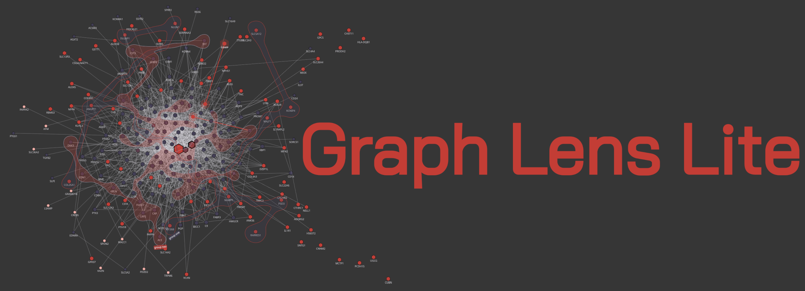
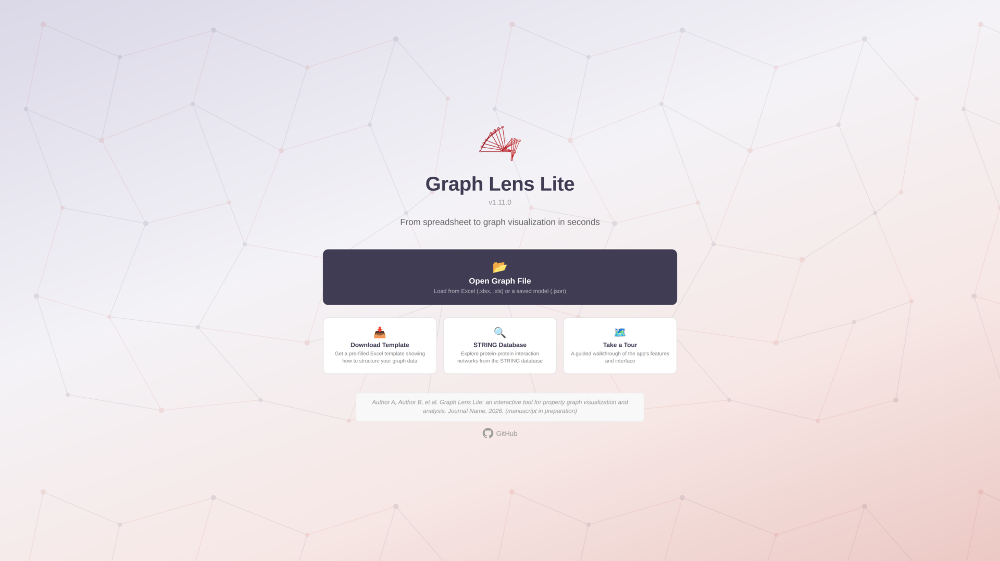
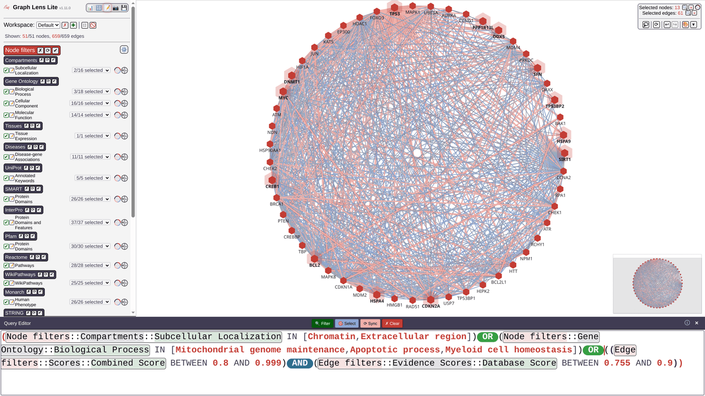
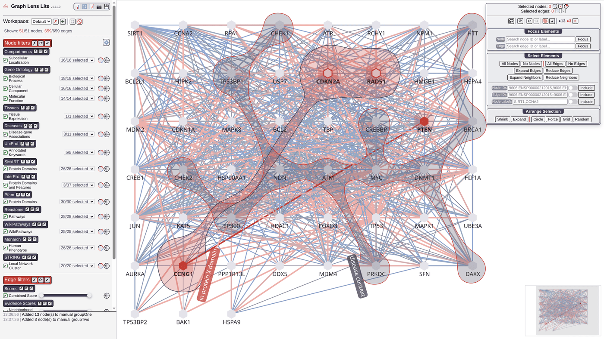
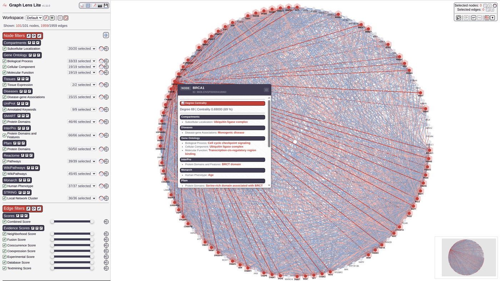
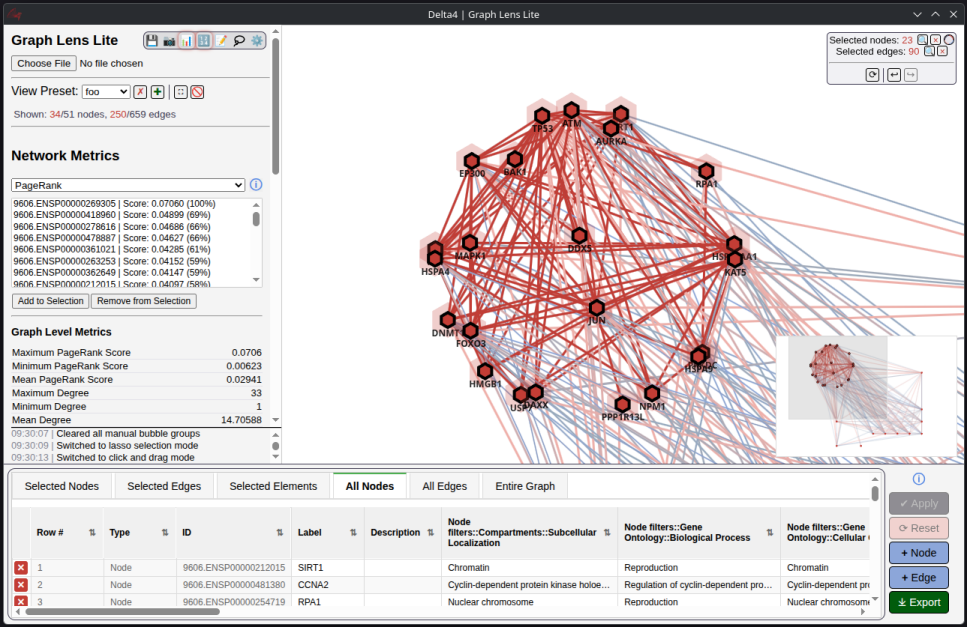
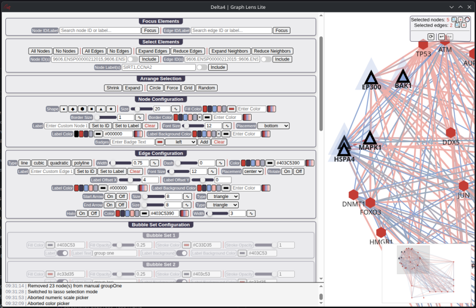
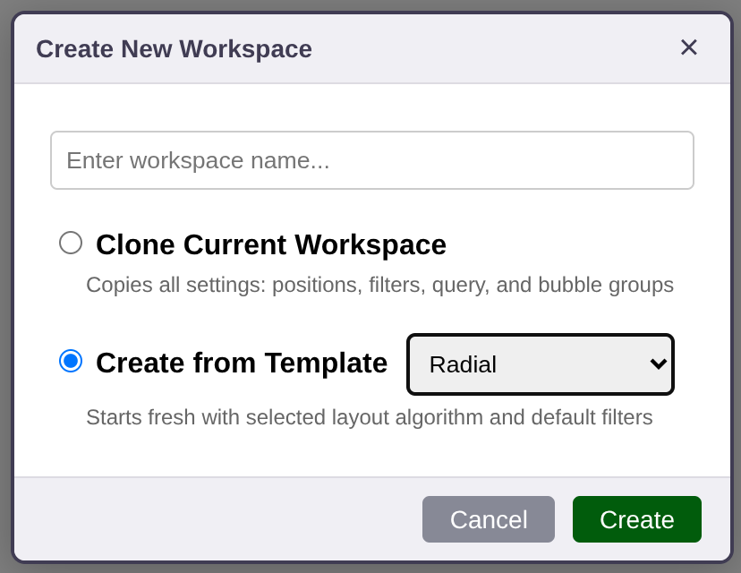
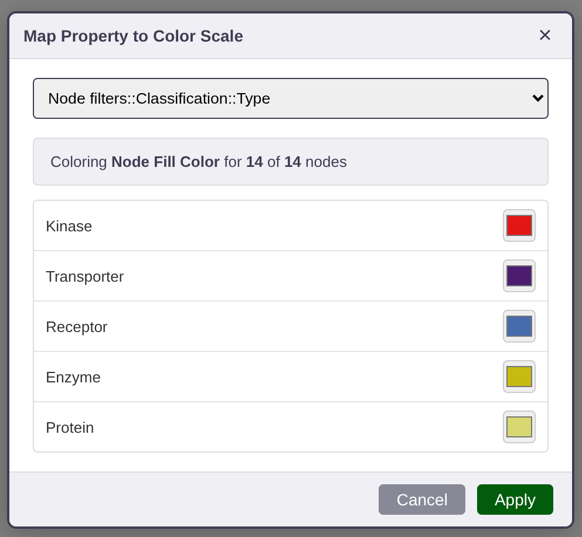
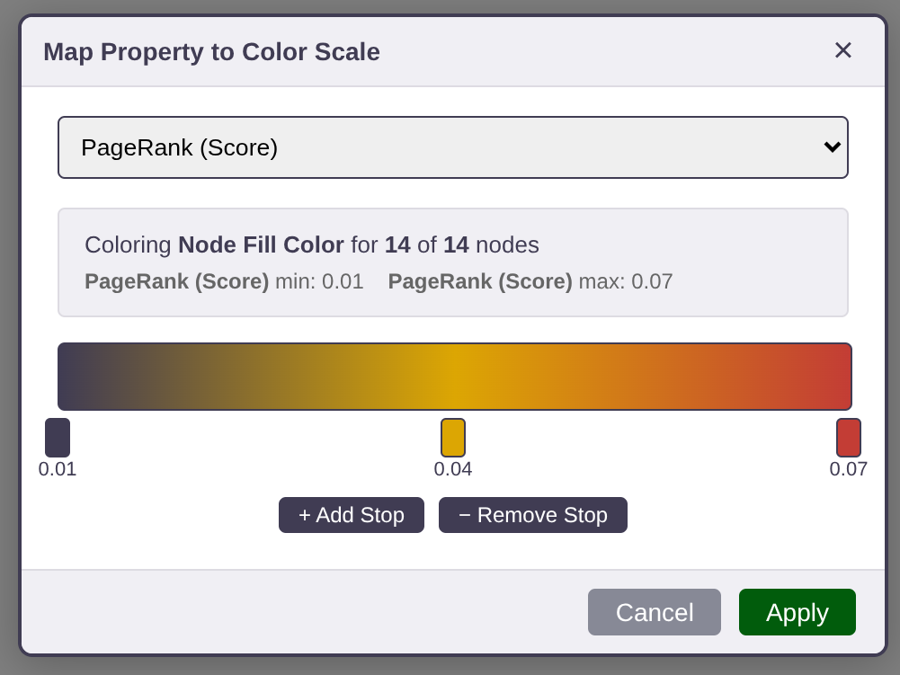

> [!WARNING]
> **This repository has moved!** The new home for this project is [Delta4AI/GraphLensLite](https://github.com/Delta4AI/GraphLensLite).

<p align="center">
  
</p>

<h3 align="center">
   Visualise and navigate property graphs through a sleek, ultra-lightweight interface.<br>
   Works in any modern browser, with native Electron desktops for Windows, macOS, and Linux.
</h3>

<p align="center">
  <a href="https://delta4ai.github.io/GraphLensLite/">🔗 Live Demo</a> · <a href="https://github.com/Delta4AI/GraphLensLite/releases/latest">📦 Latest Release</a>
</p>

## Quickstart

Download the [latest release](https://github.com/Delta4AI/GraphLensLite/releases/latest) for your platform:

| Platform | Recommended download | Notes |
|----------|---------------------|-------|
| **Web** | `graph-lens-lite_inline_X.Y.Z.html` | Just open in a browser — no install needed |
| **Windows** | `Graph.Lens.Lite.X.Y.Z.exe` | Portable — run directly, nothing to install |
| **macOS** | `Graph.Lens.Lite-X.Y.Z-<arch>.dmg` | Disk image |
| **Linux** | `Graph.Lens.Lite-X.Y.Z.AppImage` | Portable — `chmod +x` and run |

> Other formats are also available: Windows installer (`.Setup.X.Y.Z.exe`), `.deb`, `.snap`, `.zip`.

Then:
1. (Optional) Download a [template](templates/simple-template.xlsx) and add your data
2. Launch Graph Lens Lite and load a demo or your file

## Features

|                                                        |                                                                   |             |
|:-----------------------------------------------------------------------------------------------------------------------------------------:|:--------------------------------------------------------------------------------------------------------------------------------------------------:|:--------------------------------------------------------------------------------------------------------------------------------------:|
|          Open Excel or JSON files, explore demo networks, or take a tour; zero install with portable versions          |                 Write expressive queries with boolean logic, nested conditions, and range operators to filter your graph                  | Lasso select elements, undo and redo, focus and expand neighborhoods, and group nodes visually |
|                                     |                             |                                                      |
| Filter by any property using range sliders and dropdown checklists, inspect node and edge metadata via tooltips, and navigate large graphs with a minimap | Compute centrality metrics like degree, betweenness, closeness, eigenvector, and PageRank, and edit your graph data live in a built-in spreadsheet |                 Customize shapes, sizes, colors, labels, halos, badges, arrows, and bubble set appearance per element                  |
|                                          |                          |                  |
|                    Create independent workspaces, each preserving their own node positions, styles, filters, and bubble set groups                     |                              Assign distinct colors to property categories like pathways, processes, or localizations                              |         Map numeric properties to continuous color gradients with configurable stops, and export graphs as JSON, PNG, or Excel         |

## Development

```bash
npm install              # install dependencies
npm run bundle:serve     # dev server with watch + sourcemaps
npm run serve            # static http-server on :8000
npm start                # electron app
npm run dist-linux       # Linux build
npm run dist-windows     # Windows build
```

See [CONTRIBUTING.md](CONTRIBUTING.md) for the full list of npm scripts, version management, code style, and commit guidelines.

## Contributing

Contributions are welcome! Please read [CONTRIBUTING.md](CONTRIBUTING.md) before filing issues or submitting pull requests.

## License

MIT — see [LICENSE](LICENSE) for details.

## Known Issues

1. Deselection by clicking on empty spaces in the canvas takes a long time on large graphs (see [GitHub issue](https://github.com/antvis/G6/issues/7195))
2. The Query Editor cursor tends to change position on multiline queries

## Disclaimer

- Uses the [STRING](https://string-db.org/) database for demo purposes ([citation](https://doi.org/10.1093/nar/gkac1000))
- No guarantees on the accuracy of the results
- This project includes third-party software — see [THIRD_PARTY_NOTICES](THIRD_PARTY_NOTICES) for details
