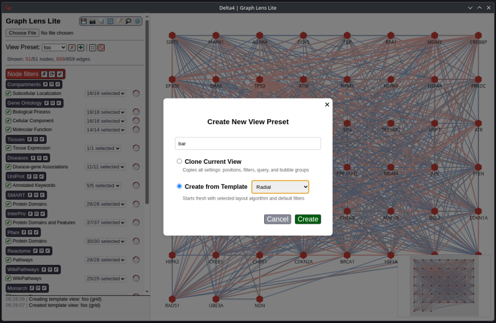
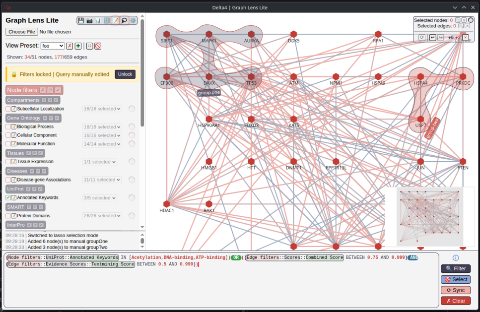

<h3 align="center">
   Visualise and navigate property graphs through a sleek, ultra-lightweight interface.  
   Works in any modern browser, with native Electron desktops for Windows and Linux.
</h3>


---

## Quickstart
1. Download the [latest release](https://github.com/Delta4AI/GraphLensLite/releases/latest).
   - **Windows**: `Graph.Lens.Lite.X.Y.Z.exe` (portable) or `Graph.Lens.Lite.Setup.X.Y.Z.exe` (installer)
   - **macOS**: `Graph.Lens.Lite-X.Y.Z-<arch>-mac.zip` or `Graph.Lens.Lite-X.Y.Z-<arch>.dmg`
   - **Linux**: `Graph.Lens.Lite-X.Y.Z.AppImage`, `graph-lens-lite_X.Y.Z_<arch>.deb`, or `graph-lens-lite_X.Y.Z_<arch>.snap`
   - **Web (no install)**: `graph-lens-lite_inline_X.Y.Z.html`
   - **From source**: clone the repo and run `npm install` then `npm run serve`
2. (Optional) Download a [template](templates/simple-template.xlsx) and add your data
3. Launch Graph Lens Lite and load a demo or your file
---

## Screenshots
### Home screen


### View & layout management


### Query editor & visual grouping


### Network metrics & data editor


### Rich styling


### Property based color & value mapping (discrete, continuous, numerical)


---
## Development
```bash
# Install dependencies
npm install                                                     # runtime dependencies
dnf install libxcrypt-compat wine                               # build dependencies
npm install --save-dev electron@latest electron-builder@latest  # update electron dependencies

# Run
npm run serve   # Start http-server
npm start       # Start electron app

# Build
npm run dist-linux     # Linux build
npm run dist-windows   # Windows build
```

---

## Contributing
Contributions are welcome! Please file issues or submit pull requests on GitHub.

---

## License
GNU GPLv3 - see [LICENSE](LICENSE) for details.

---

## Third‑Party Licenses
This project includes third‑party software. See [THIRD_PARTY_NOTICES.txt](THIRD_PARTY_NOTICES) for details.

---

## Disclaimer
- Uses [G6](https://g6.antv.vision/) and [ExcelJS](https://github.com/exceljs/exceljs) as dependency libraries
- Uses the [String](https://string-db.org/) database for Demo purposes ([citation](https://doi.org/10.1093/nar/gkac1000))
- No guarantees on the accuracy of the results

---

## Known issues

1. Deselection by clicking on empty spaces in the canvas take a long time on large graphs (see [GitHub issue](https://github.com/antvis/G6/issues/7195))
2. The Query Editor cursor tends to change position on multiline queries

---

## Reference
TBD
